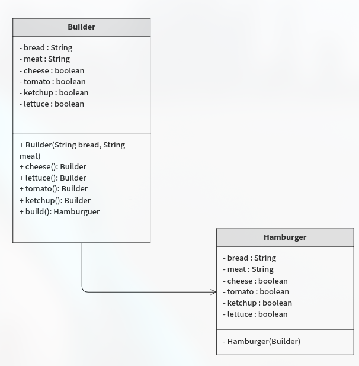

# Análisis del Problema: Implementación del Patrón Builder

A continuación, presento la documentación de análisis requerida para el taller, redactada de forma clara y accesible para tus compañeros.

## 1. Introducción y Contexto

En el desarrollo de software, nos enfrentamos frecuentemente al reto de crear objetos que tienen muchas variantes. En nuestro sistema de pedidos de comida rápida, la **Hamburguesa** es el ejemplo perfecto. No todos los clientes quieren lo mismo: algunos evitan el tomate, otros piden doble queso y algunos prefieren pan integral.

Si intentáramos resolver esto con un constructor tradicional, terminaríamos con algo llamado "Constructor Telescópico", una línea de código confusa llena de valores booleanos (`true, false, true...`) donde es imposible saber qué ingrediente estamos activando sin leer el manual.

## 2. Identificación de Atributos

Para garantizar que la hamburguesa siempre sea válida, hemos clasificado sus ingredientes en dos categorías:

**Atributos Obligatorios:** El Pan y la Carne. Sin estos, el producto no puede considerarse una hamburguesa. Por ello, el sistema obliga a definirlos desde el primer momento en que se inicia el pedido.

**Atributos Opcionales:** Queso, Tomate, Ketchup y Lechuga. Estos son "extras" que el cliente puede o no elegir. El patrón Builder nos permite añadirlos de forma flexible.

## 3. Justificación del Patrón Builder

Hemos elegido el patrón Builder por tres razones principales:

- **Legibilidad:** El código ahora se lee como una orden en la vida real: `.bread("Brioche").meat("Res").cheese()`. Es intuitivo para cualquier programador.
- **Inmutabilidad y Seguridad:** Una vez que la hamburguesa se construye con el método `build()`, sus ingredientes no pueden ser modificados. Esto evita errores en el sistema de cocina donde un ingrediente podría "cambiarse" accidentalmente después de enviada la orden.
- **Encapsulamiento:** Al usar una clase interna estática para el Builder, logramos que el constructor de la Hamburguesa sea privado. Esto significa que nadie puede crear una hamburguesa "por error" sin pasar por el proceso de construcción correcto.

## 4. Diagrama UML

  

## 4. Estructura de la Solución

La solución se organiza separando la lógica en paquetes:

- **Paquete `models`:** Contiene la definición de la hamburguesa y su constructor inteligente (Builder). Se definió como una clase inmutable para proteger los datos.
- **Paquete `app`:** Contiene la clase `Main`, que actúa como el cliente que realiza los pedidos utilizando la interfaz fluida (Fluent API) que proporciona el Builder.

## Conclusión del Análisis

El uso del patrón Builder transforma un proceso de creación potencialmente caótico y propenso a errores en un flujo estructurado y seguro. Esta implementación no solo cumple con los requisitos técnicos del taller, sino que mejora significativamente la calidad y el mantenimiento del código a largo plazo.
EOF
